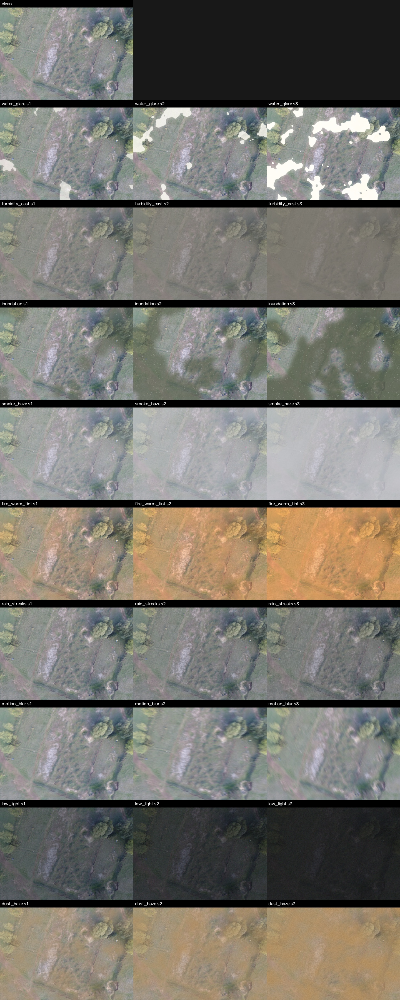

<div align="center">

# AegisBench

**A disaster-grounded robustness benchmark for aerial search-and-rescue person detection**

[](LICENSE)
[](pyproject.toml)
[]()

</div>

Standard aerial search-and-rescue (SAR) benchmarks are collected in calm,
clear conditions. Real SAR missions are not: they happen during floods,
wildfires, storms, and at night, exactly when the imagery least resembles
what the detector was trained and tested on. **AegisBench measures that
gap directly.**

We apply nine physically motivated visual corruptions, spanning four
disaster families and three calibrated severities each, to two established
aerial person-detection datasets, and evaluate three architecturally
distinct detectors under one shared, deployment-realistic protocol.

> **Headline finding.** Under low-light conditions, detection does not
> degrade, it collapses. Recall falls to **exactly 0.000** (bootstrap 95% CI:
> `[0.000, 0.000]`) on both datasets and for all three detector
> architectures. See [Results](#results) below.

<p align="center">
  
  <br>
  <sub>One HERIDAL frame under every corruption. Rows: clean, then the nine corruptions. Columns: severities 1&ndash;3.</sub>
</p>

---

## Table of contents

- [Why this benchmark](#why-this-benchmark)
- [The nine corruptions](#the-nine-corruptions)
- [Evaluation protocol](#evaluation-protocol)
- [Results](#results)
- [Repository layout](#repository-layout)
- [Quickstart](#quickstart)
- [Full pipeline](#full-pipeline)
- [Datasets](#datasets)
- [Reproducibility](#reproducibility)
- [Citation](#citation)
- [License](#license)

---

## Why this benchmark

Detectors are usually reported as a single accuracy number measured on
imagery collected under good conditions. That number says nothing about what
happens when the same detector is flown into the disaster it is meant to
help with. AegisBench closes that gap with three design commitments:

1. **Physically motivated corruptions, not generic noise.** Every corruption
   models a documented optical phenomenon, not an arbitrary filter. Haze
   uses the Koschmieder atmospheric scattering model. Low light is modeled
   in a linear photometric domain with signal-dependent shot noise. Dust is
   distinguished from wildfire smoke by airlight chromaticity, not by a
   label alone.
2. **Calibrated, not eyeballed, severities.** Each corruption's three
   severity levels are defined by a measurable image statistic, declared in
   [`configs/corruptions.yaml`](configs/corruptions.yaml) and machine-verified
   for monotonicity. What "severity 2" means is falsifiable, not a guess.
3. **A deployment-realistic evaluation protocol.** Every detector's
   confidence threshold is selected once, on clean validation data, and
   frozen across all 28 test conditions, exactly as a real deployed system
   would work. One shared evaluator scores every architecture so results are
   directly comparable.

Full design rationale and physical grounding: [`docs/CORRUPTIONS.md`](docs/CORRUPTIONS.md).

## The nine corruptions

| Corruption | Family | Optical mechanism | Severity statistic |
| --- | --- | --- | --- |
| `water_glare` | Flood | Specular sun-glint saturating the sensor | Saturated pixel fraction |
| `turbidity_cast` | Flood | Sediment-laden water: mud cast, contrast loss | RMS contrast |
| `inundation` | Flood | Semi-transparent standing water occlusion | Occluded pixel fraction |
| `smoke_haze` | Wildfire | Koschmieder scattering, neutral-gray airlight | RMS contrast |
| `fire_warm_tint` | Wildfire | Low-CCT fire illumination, warm airlight haze | Red / blue ratio |
| `rain_streaks` | Storm | Additive directional rain streaks + veil | Streak density |
| `motion_blur` | Storm | Wind-induced platform shake | Edge strength |
| `low_light` | Storm / earthquake | Photon scaling, twilight shift, shot + read noise | Mean luminance |
| `dust_haze` | Earthquake | Koschmieder with brown mineral airlight + grain | RMS contrast |

Every pixel-unit parameter is specified per 1000 px of image size and scaled
at runtime, so a given severity means the same thing on a 4000x3000 HERIDAL
frame and a 640x640 SARD frame. All corruptions are appearance-only
(they recolor, darken, or occlude without moving content), so ground-truth
boxes drawn on the clean image remain valid on the corrupted one.

## Evaluation protocol

| Guard | What it prevents |
| --- | --- |
| Confidence threshold frozen from clean validation, never re-tuned per condition | Reporting a best-case, clairvoyant-operator number instead of what a deployed system achieves |
| One shared evaluator for every architecture | Scoring inconsistencies between frameworks |
| Group-aware train/val/test split (SARD is video; a whole sequence goes to one split) | Near-duplicate frames leaking across splits and inflating scores |
| Deterministic seeding: every stochastic draw derives from a stable hash of `(image_id, corruption, severity, global_seed)` | A "benchmark" that is actually a different random draw every run |
| Corruption applied to the full frame before tiling | Atmospheric effects (haze gradients, flood masks) that are spatially coherent in reality being faked as tile-independent |
| Bootstrap confidence intervals (1000 resamples per condition) on every headline metric | Presenting a single noisy run as a stable finding |
| Localization stability as a second axis, isolated to instances detected in both conditions | Conflating "lost the detection" with "kept it but the box drifted" |
| Git SHA, config hash, seed, and timestamp logged per result row | Results that cannot be traced back to the exact code that produced them |

## Results

Full sweep: 3 detectors (Faster R-CNN, YOLOv11, RT-DETR) x (1 clean +
9 corruptions x 3 severities) x 2 datasets = **168 evaluation conditions**,
all inference-only against operating points frozen on clean validation data.

### The low-light collapse

Recall at each model's frozen operating point, mean over 1000 bootstrap
resamples with 95% confidence interval.

**HERIDAL** (`n` = 101 test images):

| Model | Frozen threshold | Severity 1 | Severity 2 | Severity 3 |
| --- | --- | --- | --- | --- |
| RT-DETR | 0.65 | 0.000 [0.000, 0.000] | 0.000 [0.000, 0.000] | 0.000 [0.000, 0.000] |
| YOLOv11 | 0.45 | 0.048 [0.027, 0.073] | 0.000 [0.000, 0.000] | 0.000 [0.000, 0.000] |
| Faster R-CNN | 0.99 | 0.452 [0.365, 0.540] | 0.110 [0.064, 0.163] | 0.000 [0.000, 0.000] |

**SARD** (`n` = 862 test images), point estimates, all three models:

| Model | Frozen threshold | Severity 1 | Severity 2 | Severity 3 |
| --- | --- | --- | --- | --- |
| Faster R-CNN | 0.96 | 0.419 | 0.077 | 0.000 |
| RT-DETR | 0.60 | 0.260 | 0.013 | 0.000 |
| YOLOv11 | 0.30 | 0.184 [0.157, 0.212] | 0.007 [0.003, 0.012] | 0.000 [0.000, 0.000] |

A `[0.000, 0.000]` interval means every one of the 1000 bootstrap resamples
produced zero recall: not "usually fails", but fails on every resampling of
the evaluation data. Total collapse by severity 3 replicates across both
datasets and all three architecturally unrelated detectors, which is what
makes it a property of the task rather than a quirk of one model. The one
architecture-specific claim that does **not** replicate: RT-DETR is the
most fragile of the three on HERIDAL even at the mildest severity, but on
SARD it retains more capability than YOLOv11 at that same severity, the
ordering flips. What holds on both datasets is that Faster R-CNN is
consistently the most robust of the three, that is a safe general claim;
which of the other two is second-most fragile depends on the dataset.

### The full severity spectrum is not uniform

SARD, YOLOv11, mean bootstrap recall by corruption and severity:

| Corruption | Severity 1 | Severity 2 | Severity 3 |
| --- | --- | --- | --- |
| `rain_streaks` | 0.893 | 0.883 | **0.855** |
| `inundation` | 0.860 | 0.744 | 0.494 |
| `smoke_haze` | 0.810 | 0.667 | 0.391 |
| `water_glare` | 0.859 | 0.809 | 0.666 |
| `motion_blur` | 0.792 | 0.613 | 0.477 |
| `turbidity_cast` | 0.796 | 0.576 | 0.191 |
| `dust_haze` | 0.673 | 0.272 | 0.058 |
| `fire_warm_tint` | 0.689 | 0.311 | 0.099 |
| `low_light` | 0.184 | 0.007 | **0.000** |

At matched severity 3, heavy rain costs about four points of recall while
low light costs all of it. That spread, produced by corruptions calibrated
on comparable statistical ladders, is what makes the benchmark diagnostic
rather than merely difficult.

Aggregated by disaster family (mean relative recall drop, HERIDAL): storm
is worst for every model (0.78&ndash;0.87, dominated by `low_light`), flood
is mildest for every model (0.23&ndash;0.30). The same ordering mostly
holds on SARD, except earthquake (`dust_haze`) edges out storm as the worst
family there. Full per-model, per-family table:
[`docs/PAPER_GUIDE.md`](docs/PAPER_GUIDE.md#5-what-we-have-already-measured).

### Detections that survive stay accurately placed

We separately measure localization stability: for instances detected in
*both* the clean and corrupted conditions, how much does the predicted box
drift? Even at severity 3, surviving detections retain 0.78&ndash;0.91 IoU
against their own clean-condition box, while the *count* of surviving
detections collapses in lockstep with recall. In this domain, corruption
does not make detectors imprecise, it makes them stop seeing the person
at all. Full methodology and numbers:
[`src/aegisbench/evaluation/localization.py`](src/aegisbench/evaluation/localization.py).

## Repository layout

| Path | Purpose |
| --- | --- |
| `configs/corruptions.yaml` | Canonical corruption parameter table: 9 corruptions x 3 severities, each calibrated by a measurable image statistic |
| `configs/train_*.yaml`, `configs/sweep_models*.yaml` | Per-detector training and sweep configs |
| `src/aegisbench/corruptions/` | Deterministic corruption engine (pure NumPy / OpenCV, no GPU required) |
| `src/aegisbench/tiling.py` | Overlapping-tile pipeline for large aerial frames with exact bbox remapping |
| `src/aegisbench/evaluation/` | Shared evaluator: COCO mAP, fixed-threshold P/R, size-stratified recall, relative-drop robustness, localization stability, bootstrap CIs |
| `src/aegisbench/models/` | YOLOv11 / RT-DETR (Ultralytics) and Faster R-CNN (torchvision) behind one interface |
| `scripts/phase*.py` | The phased experimental protocol, each phase ending in a stop-and-inspect checkpoint |
| `docs/RUNBOOK.md` | Exactly what to run, phase by phase, and what to verify at each checkpoint |
| `docs/CORRUPTIONS.md` | Physical grounding and calibration methodology for every corruption |
| `docs/DATA.md` | How to obtain HERIDAL and SARD, expected layouts, split policy |
| `docs/PAPER_GUIDE.md` | Full drafting guide: contributions, literature review scaffold, rigor checklist, figures plan |
| `tests/` | Unit tests, several of which directly encode claims made in the paper (e.g. dust vs. smoke chromaticity) |

## Quickstart

```bash
# 1. Environment (GPU machine; see docs/RUNBOOK.md for the Blackwell note)
bash scripts/setup_env_sm120.sh
python scripts/phase0_check_gpu.py            # must print PHASE 0: PASS

# 2. Unit tests + a GPU-free demo of the corruption engine and tiling
pip install -e ".[dev]" && pytest
python scripts/make_synthetic_samples.py --out data/synthetic --n 3
python scripts/phase3_generate_grid.py \
    --image data/synthetic/synthetic_000.jpg --out results/phase3/grid.jpg
```

## Full pipeline

Each phase in [`docs/RUNBOOK.md`](docs/RUNBOOK.md) ends with an artifact to
inspect before the next phase is allowed to run; later phases assume earlier
checkpoints were verified.

| Phase | What it does |
| --- | --- |
| 0 | Environment and GPU verification |
| 1 | Data preparation, group-aware splitting, visual label checks |
| 2 | Overlapping-tile pipeline for large frames |
| 3 | Corruption engine plausibility grid and calibration audit |
| 4 | Clean-baseline training for all three detectors |
| 5 | The full stress-test sweep across every corruption, severity, and detector |
| 6 | Disaster-aware training augmentation as mitigation, with ablations |

## Datasets

AegisBench evaluates on two datasets spanning the two dominant real-world
capture regimes:

- **[HERIDAL](docs/DATA.md#heridal)**: high-altitude orthophoto search
  imagery (~4000x3000), 101 official test images.
- **[SARD](docs/DATA.md#sard)**: lower-altitude drone video frames
  (a Roboflow re-export resized to 640x640), split group-aware by filename
  token to prevent near-duplicate leakage.

Neither dataset is redistributed by this repository; both require manual
download under their own licenses. See [`docs/DATA.md`](docs/DATA.md) for
sources, expected layout, and split policy.

## Reproducibility

- Every stochastic element of every corruption is seeded by a stable SHA-256
  hash of `(image_id, corruption, severity, global_seed)`, independent of
  `PYTHONHASHSEED` and platform. The corrupted test sets are fixed datasets,
  bit-identical on any machine.
- Training configs (`configs/train_*.yaml`) carry fixed seeds and are copied
  verbatim into each run directory.
- The sweep CSV logs git SHA, corruption-config hash, seed, and timestamp
  per row, and every long-running phase (training, sweeping, bootstrap CI,
  localization) is resumable from an interruption without recomputation of
  already-finished work.
- One evaluator scores every model; operating points are selected on clean
  validation data once and frozen across all corruption conditions.
- Raw predictions are archived per condition, so downstream analyses
  (confidence intervals, localization stability) never require re-running
  inference.

## Citation

The paper is currently under review. A full citation will be added here upon
publication.

```bibtex
@inproceedings{aegisbench,
  title     = {AegisBench: A Disaster-Grounded Robustness Benchmark for
               Aerial Search-and-Rescue Person Detection},
  author    = {TODO},
  booktitle = {IEEE/CVF Winter Conference on Applications of Computer Vision (WACV)},
  year      = {2027},
  note      = {under review}
}
```

## License

Released under the [MIT License](LICENSE). Neither HERIDAL nor SARD is
redistributed here; obtain each under its own license per
[`docs/DATA.md`](docs/DATA.md).

---

<sub>Before exporting any double-blind submission archive: run
<code>python -m aegisbench.anonymize --root .</code> and export with
<code>git archive</code> so <code>.git</code> history never ships. See
<a href="src/aegisbench/anonymize.py"><code>src/aegisbench/anonymize.py</code></a>.</sub>
